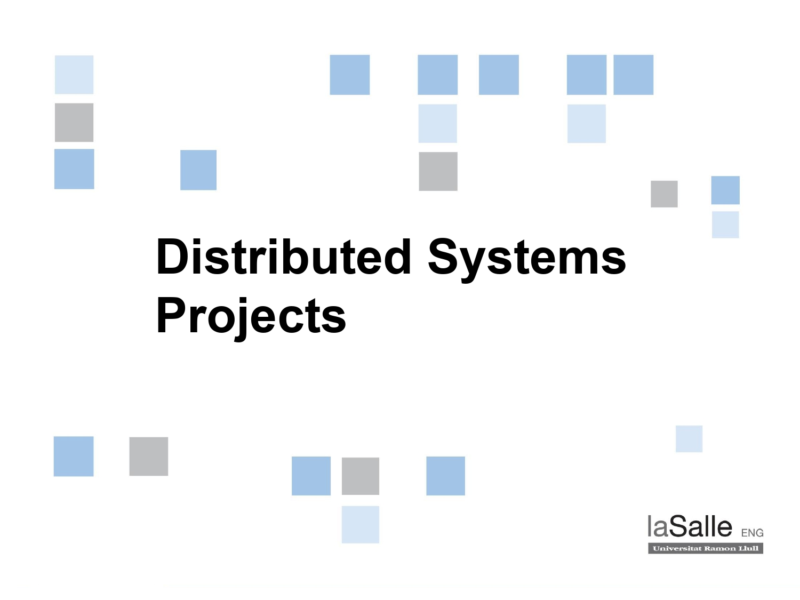

# Distributed Systems - Exercises

En aquest repositori es troben els exercicis realitzats durant l'assignatura de Sistemes Distribuïts de 4t de carrera al grau d'Enginyeria Informàtica de La Salle Campus Barcelona.

  

### Authors
- [Guillem Godoy Hernández](https://github.com/guillemghdz) (guillem.godoy)
- [Marc Geremias Serra](https://github.com/marcgeremias) (marc.geremias)
